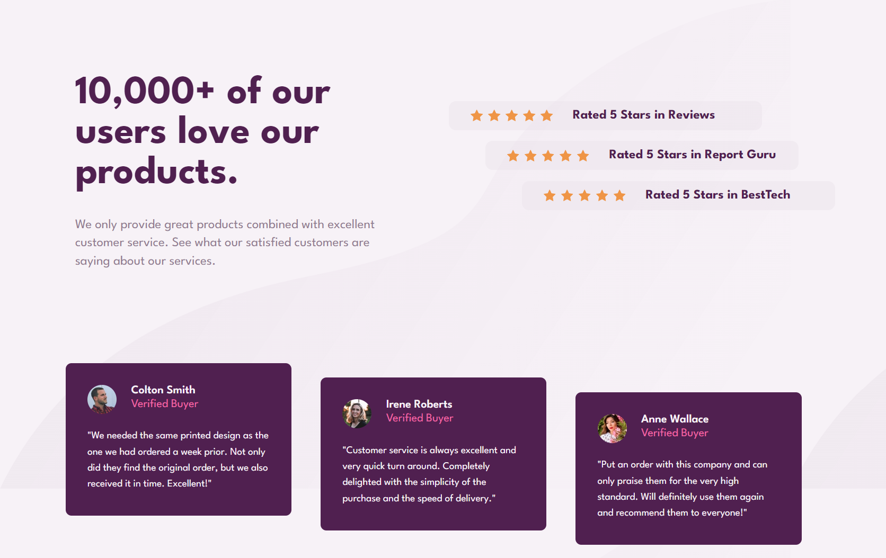

## Índice

- [Visão geral](#visão-geral)
  - [O desafio](#o-desafio)
  - [Screenshot](#screenshot)
  - [Links](#links)
- [Meu processo](#meu-processo)
  - [Construído com](#construido-com)
  - [O que eu aprendi](#o-que-eu-aprendi)
  - [Desenvolvimento contínuo](#desenvolvimento-continuo)

### Visão geral

### O desafio

Os usuários devem ser capazes de:

- Veja o layout ideal para a seção, dependendo do tamanho da tela do dispositivo

### Captura de tela




### Links

- Solution URL: [https://github.com/Vitor-Hideki/secao-de-prova-social.git](https://your-solution-url.com)

## Meu processo

### Construído com

- Marcação HTML5 semântica
- Propriedades personalizadas CSS
- Flexbox

### O que eu aprendi

Nesse projeto aprendi a utilizar melhor o flexbox, e utilizar outras propriedades do justify-content, para a distribuição dos itens dentro do container, e a utilização do gap, para o controle do espaço entre os itens flexíveis. 

```css
.conteudo{
    width: 100%;
    height: 45%;
    display: flex;
    flex-direction: row;
    justify-content:flex-start;
    gap:80px;
}
```

### Desenvolvimento contínuo

Vou continuar praticando mais com HTML e CSS para meus projetos futuros. Vou bucar melhorias no meu código como das divisões do html, de posicionamento do itens no css, aprender sobre tabelas e formuulários.


